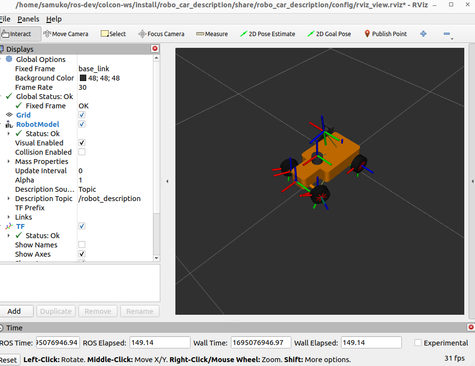
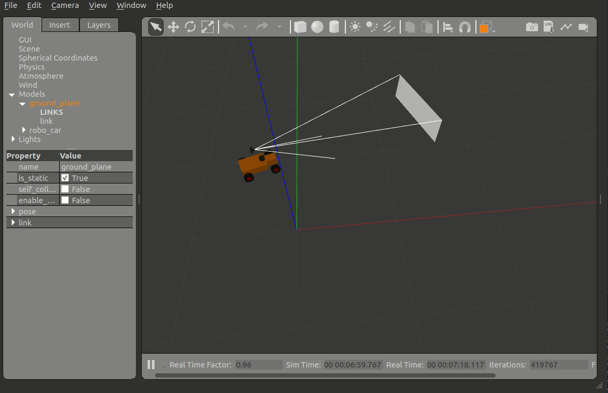
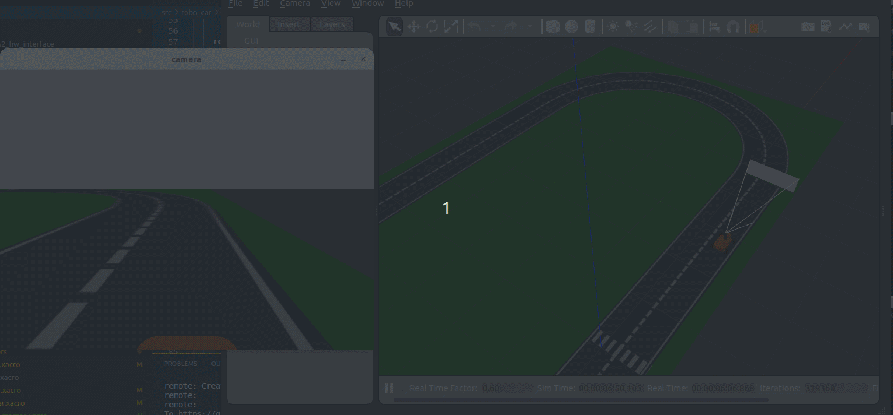

# robo_car
This is a four wheel drive ackermann steer robot.

> NOTE: development is done in ros2-humble.

first install the following (if you don't have them):
- pynput
  ```shell
  pip3 install pynput
  ```
- opencv
  ```shell
  sudo apt install python3-opencv -y
  ```
- ros2 humble vision-opencv package
  ```shell
  sudo apt install ros-humble-vision-opencv
  sudo apt install ros-humble-image-transport-plugins
  ```
- setup tool (ros2 python dev)
  ```shell
  pip3 install setuptools==58.2.0
  ```

clone (git clone git@github.com:samuko-things/robo_car.git) or Download
the repo or in your ROS2 workspace, build all packages, and source it.

```shell
colcon build --packages-select robo_car_description my_ackermann_drive_controller robo_car_view_cam pynput_ackermann_teleop_drive --symlink-install
```

## Basic Launch

**to view robot in RVIZ:**



```shell
$ ros2 launch mobo_bot_description rviz.launch.py
```

**to spawn robot in gazebo:**



```shell
$ ros2 launch mobo_bot_description sim.launch.py
```

**opencv racetrack simulation:**



```shell
$ ros2 launch robo_car_description sim_racetrack1.launch.py 
```
in a new terminal run:
```shell
$ ros2 run robo_car_view_cam view_cam
```

in a new terminal run (to drive robot with arrow key):
```shell
$ ros2 run pynput_ackermann_teleop_drive pynput_ackermann_teleop_drive
```